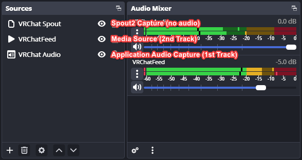

# VaOBS - VRChat OBS Video Capture Tool

VaOBS is a tool to capture a video playing inside of VRChat directly from OBS as it's own media source.

It's recommended to record VRChat's audio on a different track then the Media Source track in OBS, so you can shift the audio in post-processing if needed. This is needed for non-low-latency video playbacks in VRChat, like YouTube videos or Twitch streams.

OBS Settings:
* Setup a Media Source in OBS, default name is "VRChatFeed"

`OBS > Tools > WebSocket Server Settings`
* Enable WebSocket server
* Enable Authentication
* Show Connection Info

OBS Example Scene:
Application Audio Capture is in sync with Spout2 Capture. The Media Source can be slightly out of sync depending on the source, which is why it's keept on the 2nd Track. Allows later to adjust Track #2 to Track #1, to match Spout visiuals.



Usage:
Download the vaobs.exe file and run it directly on Windows in cmd. Use `--help` to see available commands.

```shell
vaobs.exe --help
#Usage of vaobs.exe:
#  -input-name string
#        OBS input source name (default "VRChatFeed")
#  -obs-host string
#        OBS WebSocket host (default "localhost")
#  -obs-password string
#        OBS WebSocket password
#  -obs-port int
#        OBS WebSocket port (default 4455)
```

## Support
* [Create Ticket](https://github.com/Hackebein/VaOBS/issues/new)
* [Hackebein's Research Lab](https://discord.gg/AqCwGqqQmW) at discord.gg
